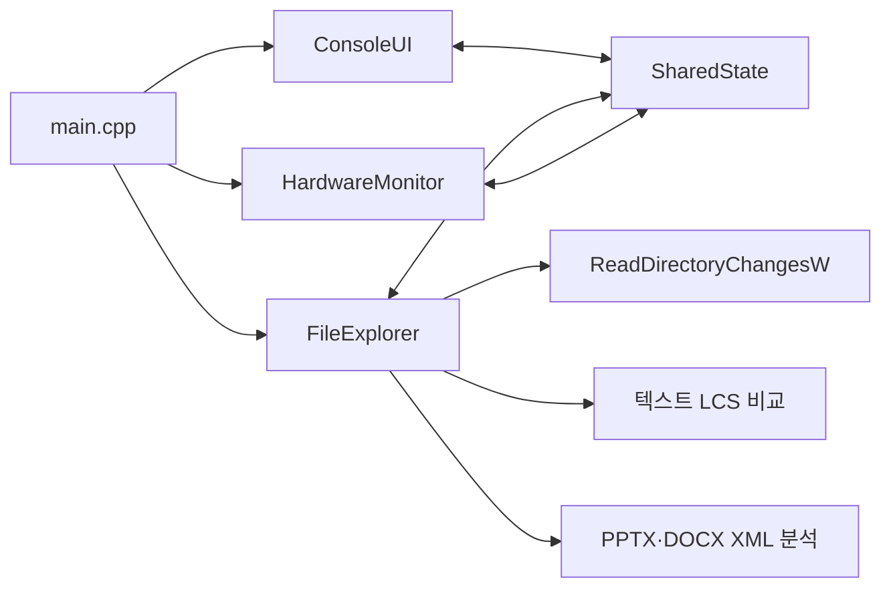

# File Explorer Extended

Windows 파일 탐색기에 **실시간 파일 변경 감지**와 **하드웨어 모니터링**을 결합한 C++ 데스크톱 애플리케이션입니다. 3인 팀으로 진행한 기말고사 대체 과제입니다.

## 팀원

| 이름 | 학번 | 담당 역할 |
| --- | --- | --- |
| 김형균 | 202607922 | 팀장, 프로젝트 구조 설계, 하드웨어 정보, 로그 관리 |
| 최가은 | 202607901 | 경로 탐색 및 검색 기능, UI/UX 개선 |
| 이정환 | 202607915 | 문서 변경 감지 기능, Office 기능 |

## 주요 기능

### 파일 탐색

- 현재 폴더의 파일과 하위 폴더를 이름순으로 표시
- 폴더를 먼저 정렬하고 파일 크기를 읽기 쉬운 단위로 표시
- 폴더 및 파일을 더블 클릭해 이동하거나 기본 프로그램으로 실행
- 상위 폴더 이동, 새로고침, 마우스 휠 및 스크롤바 지원
- Desktop, Downloads, Documents, Pictures, 프로젝트 폴더 바로가기 제공
- 파일명을 기준으로 대소문자 구분 없이 실시간 검색

### 실시간 파일 변경 감지

- Windows `ReadDirectoryChangesW` API로 현재 폴더의 생성, 삭제, 수정, 이름 변경 감지
- 최근 변경 내역을 종류별 색상 및 감지 시각과 함께 표시
- 같은 파일에서 짧은 시간 안에 반복된 이벤트를 하나로 합쳐 중복 표시 최소화
- Office 잠금 파일과 `.tmp` 파일을 제외해 불필요한 이벤트 감소
- 최대 200개의 변경 이벤트 보관

### 파일 내용 변경 비교

- 일반 텍스트 파일의 크기, 줄 수, 내용 변경을 비교
- LCS(Longest Common Subsequence) 기반으로 추가·삭제된 줄과 변경된 글자를 표시
- `.txt`, `.md`, `.json`, `.xml`, `.cpp`, `.h`, `.py`, `.java` 등 다양한 텍스트 확장자 지원
- `.pptx`의 슬라이드 수와 슬라이드별 텍스트 변경 감지
- `.docx`의 본문 텍스트 변경 감지
- Office 문서는 ZIP/XML 구조를 직접 분석하며, 변경되지 않은 문서는 캐시를 재사용

> 내용 비교는 성능과 메모리 사용을 고려해 100MB 이하의 파일을 대상으로 합니다.

### 하드웨어 모니터링

- 시스템 전체 CPU 사용률 표시
- 전체·사용 중인 RAM 용량과 메모리 사용률 표시
- CPU 사용률 히스토리 그래프 제공
- 별도 스레드에서 1초 간격으로 측정해 UI 응답성 유지

## 화면 구성

| 영역 | 설명 |
| --- | --- |
| 상단 | 상위 폴더 이동, 새로고침, 현재 경로, 파일 검색 |
| 왼쪽 | 자주 사용하는 폴더 바로가기 |
| 가운데 | 현재 폴더의 파일·폴더 목록 |
| 오른쪽 위 | 실시간 파일 변경 내역 |
| 오른쪽 아래 | CPU·RAM 사용량과 CPU 히스토리 |

## 프로젝트 구조

```text
.
├─ include/
│  ├─ Common.h             # 공유 데이터 구조, 동기화 도구, 이벤트 타입
│  ├─ ConsoleUI.h          # Win32 GUI 인터페이스
│  ├─ FileExplorer.h       # 폴더 탐색 및 변경 감지 인터페이스
│  ├─ HardwareMonitor.h    # CPU·메모리 모니터링 인터페이스
│  ├─ OfficeText.h         # PPTX·DOCX 텍스트 추출 인터페이스
│  ├─ dprint.h             # 파일 로깅 인터페이스
│  └─ miniz_single.h       # ZIP 압축 해제용 단일 헤더 라이브러리
├─ src/
│  ├─ main.cpp             # 프로그램 진입점 및 명령 처리
│  ├─ ConsoleUI.cpp        # 화면 렌더링과 사용자 입력 처리
│  ├─ FileExplorer.cpp     # 파일 목록 스캔, 감시, 내용 비교
│  ├─ HardwareMonitor.cpp  # CPU·RAM 측정 스레드
│  ├─ OfficeText.cpp       # PPTX·DOCX 내부 XML 분석
│  └─ dprint.cpp           # 로그 파일 출력
├─ Project1/
│  ├─ Project1.slnx        # Visual Studio 솔루션
│  └─ Project1.vcxproj     # C++ 프로젝트 설정
├─ ExplorerMonitorGui.exe  # 빌드된 GUI 실행 파일
└─ ExplorerMonitor.exe     # 빌드된 실행 파일
```

## 동작 구조



`FileExplorer`와 `HardwareMonitor`는 각각 별도 작업 스레드에서 동작합니다. 수집한 정보는 `SharedState`에 저장하며, `CRITICAL_SECTION`으로 여러 스레드의 동시 접근을 보호합니다. `ConsoleUI`는 공유 상태를 읽어 Win32 GDI로 화면을 그립니다.

## 사용한 주요 Win32 API

프로젝트에서 실제 호출하는 Win32 API를 역할별로 정리했습니다. 함수명을 누르면 Microsoft Learn 공식 문서로 이동합니다.

### 파일 및 디렉터리 처리

| API | 프로젝트에서의 사용 목적 |
| --- | --- |
| [`GetCurrentDirectoryW`](https://learn.microsoft.com/windows/win32/api/processenv/nf-processenv-getcurrentdirectoryw) | 프로그램 시작 폴더와 프로젝트 폴더 바로가기 경로 확인 |
| [`GetFullPathNameW`](https://learn.microsoft.com/windows/win32/api/fileapi/nf-fileapi-getfullpathnamew), [`GetFileAttributesW`](https://learn.microsoft.com/windows/win32/api/fileapi/nf-fileapi-getfileattributesw) | 입력된 경로를 절대 경로로 변환하고 유효한 폴더인지 확인 |
| [`FindFirstFileW`](https://learn.microsoft.com/windows/win32/api/fileapi/nf-fileapi-findfirstfilew), [`FindNextFileW`](https://learn.microsoft.com/windows/win32/api/fileapi/nf-fileapi-findnextfilew), [`FindClose`](https://learn.microsoft.com/windows/win32/api/fileapi/nf-fileapi-findclose) | 현재 폴더의 파일·폴더 목록, 크기, 수정 시각 수집 |
| [`CreateFileW`](https://learn.microsoft.com/windows/win32/api/fileapi/nf-fileapi-createfilew) | 폴더 감시 핸들과 PPTX·DOCX 읽기용 파일 핸들 생성 |
| [`ReadFile`](https://learn.microsoft.com/windows/win32/api/fileapi/nf-fileapi-readfile) | Office 파일을 메모리로 읽어 ZIP/XML 내용 분석 |
| [`ReadDirectoryChangesW`](https://learn.microsoft.com/windows/win32/api/winbase/nf-winbase-readdirectorychangesw) | 현재 폴더의 파일 생성·삭제·수정·이름 변경을 실시간 감지 |
| [`CancelIoEx`](https://learn.microsoft.com/windows/win32/api/ioapiset/nf-ioapiset-cancelioex) | 감시 폴더 변경 또는 종료 시 대기 중인 디렉터리 I/O 취소 |
| [`CloseHandle`](https://learn.microsoft.com/windows/win32/api/handleapi/nf-handleapi-closehandle) | 파일, 폴더, 스레드, 이벤트 핸들 정리 |
| [`ShellExecuteW`](https://learn.microsoft.com/windows/win32/api/shellapi/nf-shellapi-shellexecutew) | 선택한 파일을 Windows 기본 연결 프로그램으로 실행 |

### 스레드 및 동기화

| API | 프로젝트에서의 사용 목적 |
| --- | --- |
| [`CreateThread`](https://learn.microsoft.com/windows/win32/api/processthreadsapi/nf-processthreadsapi-createthread) | 폴더 감시와 하드웨어 측정을 각각 별도 스레드에서 실행 |
| [`CreateEventW`](https://learn.microsoft.com/windows/win32/api/synchapi/nf-synchapi-createeventw), [`SetEvent`](https://learn.microsoft.com/windows/win32/api/synchapi/nf-synchapi-setevent) | 하드웨어 모니터링 스레드에 종료 신호 전달 |
| [`WaitForSingleObject`](https://learn.microsoft.com/windows/win32/api/synchapi/nf-synchapi-waitforsingleobject) | 종료 이벤트를 기다리거나 작업 스레드가 끝날 때까지 대기 |
| [`InitializeCriticalSection`](https://learn.microsoft.com/windows/win32/api/synchapi/nf-synchapi-initializecriticalsection), [`EnterCriticalSection`](https://learn.microsoft.com/windows/win32/api/synchapi/nf-synchapi-entercriticalsection), [`LeaveCriticalSection`](https://learn.microsoft.com/windows/win32/api/synchapi/nf-synchapi-leavecriticalsection), [`DeleteCriticalSection`](https://learn.microsoft.com/windows/win32/api/synchapi/nf-synchapi-deletecriticalsection) | 여러 스레드가 공유 상태와 로그에 동시에 접근하지 않도록 보호 |
| [`Sleep`](https://learn.microsoft.com/windows/win32/api/synchapi/nf-synchapi-sleep) | 폴더 변경 감시 오류 발생 시 짧게 대기한 뒤 재시도 |
| [`GetTickCount64`](https://learn.microsoft.com/windows/win32/api/sysinfoapi/nf-sysinfoapi-gettickcount64) | 변경 이벤트 시각 기록 및 350ms 이내 중복 이벤트 병합 |

### CPU 및 메모리 정보

| API | 프로젝트에서의 사용 목적 |
| --- | --- |
| [`GetSystemTimes`](https://learn.microsoft.com/windows/win32/api/processthreadsapi/nf-processthreadsapi-getsystemtimes) | 이전 측정값과 현재 측정값의 차이로 시스템 전체 CPU 사용률 계산 |
| [`GlobalMemoryStatusEx`](https://learn.microsoft.com/windows/win32/api/sysinfoapi/nf-sysinfoapi-globalmemorystatusex) | 전체·가용·사용 중인 물리 메모리와 메모리 사용률 조회 |

### 창 생성 및 메시지 처리

| API | 프로젝트에서의 사용 목적 |
| --- | --- |
| [`RegisterClassExW`](https://learn.microsoft.com/windows/win32/api/winuser/nf-winuser-registerclassexw) | 메인 창에서 사용할 윈도우 클래스 등록 |
| [`CreateWindowExW`](https://learn.microsoft.com/windows/win32/api/winuser/nf-winuser-createwindowexw) | 메인 창과 파일 검색 입력창 생성 |
| [`ShowWindow`](https://learn.microsoft.com/windows/win32/api/winuser/nf-winuser-showwindow), [`UpdateWindow`](https://learn.microsoft.com/windows/win32/api/winuser/nf-winuser-updatewindow) | 생성한 메인 창을 표시하고 최초 화면 갱신 |
| [`GetMessageW`](https://learn.microsoft.com/windows/win32/api/winuser/nf-winuser-getmessagew), [`TranslateMessage`](https://learn.microsoft.com/windows/win32/api/winuser/nf-winuser-translatemessage), [`DispatchMessageW`](https://learn.microsoft.com/windows/win32/api/winuser/nf-winuser-dispatchmessagew) | Win32 메시지 루프 구성 및 입력·창 이벤트 전달 |
| [`DefWindowProcW`](https://learn.microsoft.com/windows/win32/api/winuser/nf-winuser-defwindowprocw), [`PostQuitMessage`](https://learn.microsoft.com/windows/win32/api/winuser/nf-winuser-postquitmessage) | 처리하지 않은 기본 창 동작 수행 및 프로그램 종료 메시지 전달 |
| [`SetTimer`](https://learn.microsoft.com/windows/win32/api/winuser/nf-winuser-settimer), [`KillTimer`](https://learn.microsoft.com/windows/win32/api/winuser/nf-winuser-killtimer), [`InvalidateRect`](https://learn.microsoft.com/windows/win32/api/winuser/nf-winuser-invalidaterect) | 100ms 간격으로 최신 공유 상태를 화면에 다시 그리도록 요청 |
| [`GetWindowTextW`](https://learn.microsoft.com/windows/win32/api/winuser/nf-winuser-getwindowtextw), [`SendMessageW`](https://learn.microsoft.com/windows/win32/api/winuser/nf-winuser-sendmessagew) | 검색어 읽기 및 검색창 글꼴 설정 |
| [`SetWindowPos`](https://learn.microsoft.com/windows/win32/api/winuser/nf-winuser-setwindowpos) | 창 크기 변경 시 검색창의 위치와 크기 조정 |
| [`SetCapture`](https://learn.microsoft.com/windows/win32/api/winuser/nf-winuser-setcapture), [`ReleaseCapture`](https://learn.microsoft.com/windows/win32/api/winuser/nf-winuser-releasecapture), [`ScreenToClient`](https://learn.microsoft.com/windows/win32/api/winuser/nf-winuser-screentoclient) | 스크롤바를 드래그하는 동안 마우스 입력을 계속 추적 |
| [`DestroyWindow`](https://learn.microsoft.com/windows/win32/api/winuser/nf-winuser-destroywindow) | 종료 시 메인 창 자원 해제 |

### GDI 화면 렌더링

| API | 프로젝트에서의 사용 목적 |
| --- | --- |
| [`BeginPaint`](https://learn.microsoft.com/windows/win32/api/winuser/nf-winuser-beginpaint), [`EndPaint`](https://learn.microsoft.com/windows/win32/api/winuser/nf-winuser-endpaint) | `WM_PAINT` 처리 구간에서 그리기 컨텍스트 준비 및 정리 |
| [`CreateCompatibleDC`](https://learn.microsoft.com/windows/win32/api/wingdi/nf-wingdi-createcompatibledc), [`CreateCompatibleBitmap`](https://learn.microsoft.com/windows/win32/api/wingdi/nf-wingdi-createcompatiblebitmap), [`BitBlt`](https://learn.microsoft.com/windows/win32/api/wingdi/nf-wingdi-bitblt) | 메모리 DC에 화면을 먼저 그린 뒤 한 번에 복사하는 더블 버퍼링 |
| [`CreateFontW`](https://learn.microsoft.com/windows/win32/api/wingdi/nf-wingdi-createfontw) | 기본 글꼴과 제목 글꼴 생성 |
| [`CreateSolidBrush`](https://learn.microsoft.com/windows/win32/api/wingdi/nf-wingdi-createsolidbrush), [`CreatePen`](https://learn.microsoft.com/windows/win32/api/wingdi/nf-wingdi-createpen) | 패널, 버튼, 그래프에 사용할 색상 브러시와 선 생성 |
| [`DrawTextW`](https://learn.microsoft.com/windows/win32/api/winuser/nf-winuser-drawtextw), [`FillRect`](https://learn.microsoft.com/windows/win32/api/winuser/nf-winuser-fillrect) | 파일명과 상태 텍스트 출력 및 배경 영역 채우기 |
| [`RoundRect`](https://learn.microsoft.com/windows/win32/api/wingdi/nf-wingdi-roundrect), [`Rectangle`](https://learn.microsoft.com/windows/win32/api/wingdi/nf-wingdi-rectangle) | 둥근 패널, 버튼, CPU·RAM 막대그래프 그리기 |
| [`MoveToEx`](https://learn.microsoft.com/windows/win32/api/wingdi/nf-wingdi-movetoex), [`LineTo`](https://learn.microsoft.com/windows/win32/api/wingdi/nf-wingdi-lineto) | CPU 사용률 히스토리 선 그래프 그리기 |
| [`SelectObject`](https://learn.microsoft.com/windows/win32/api/wingdi/nf-wingdi-selectobject), [`DeleteObject`](https://learn.microsoft.com/windows/win32/api/wingdi/nf-wingdi-deleteobject), [`DeleteDC`](https://learn.microsoft.com/windows/win32/api/wingdi/nf-wingdi-deletedc) | GDI 객체 선택 및 사용이 끝난 폰트·펜·브러시·DC 정리 |

### 문자열, 환경 변수 및 시각 변환

| API | 프로젝트에서의 사용 목적 |
| --- | --- |
| [`GetEnvironmentVariableW`](https://learn.microsoft.com/windows/win32/api/processenv/nf-processenv-getenvironmentvariablew) | 사용자 프로필 경로를 읽어 Quick Access 경로 구성 |
| [`MultiByteToWideChar`](https://learn.microsoft.com/windows/win32/api/stringapiset/nf-stringapiset-multibytetowidechar) | PPTX·DOCX XML의 UTF-8 텍스트를 유니코드 문자열로 변환 |
| [`FileTimeToLocalFileTime`](https://learn.microsoft.com/windows/win32/api/fileapi/nf-fileapi-filetimetolocalfiletime), [`FileTimeToSystemTime`](https://learn.microsoft.com/windows/win32/api/timezoneapi/nf-timezoneapi-filetimetosystemtime) | 파일 수정 시각을 로컬 시각으로 변환 |
| [`GetLocalTime`](https://learn.microsoft.com/windows/win32/api/sysinfoapi/nf-sysinfoapi-getlocaltime) | 파일 변경이 감지된 현재 시각 표시 |

## 개발 환경 및 기술

- C++20
- Windows 10 SDK
- Win32 API / GDI
- Visual Studio C++ 프로젝트 (`Win32`, `x64` 구성)
- 멀티스레딩 및 `CRITICAL_SECTION` 동기화
- miniz 기반 ZIP 문서 분석
- 별도의 외부 패키지 설치 없이 빌드 가능

## 빌드 및 실행

### Visual Studio에서 빌드

1. Windows에서 `Project1/Project1.slnx`를 Visual Studio로 엽니다.
2. 사용할 구성과 플랫폼(예: `Debug | x64`)을 선택합니다.
3. **빌드 > 솔루션 빌드**를 실행합니다.
4. 빌드된 실행 파일을 실행합니다.

프로젝트 설정에 지정된 MSVC 플랫폼 도구 집합과 Windows 10 SDK가 설치되어 있어야 합니다. 도구 집합 버전이 다른 경우 Visual Studio의 프로젝트 대상 변경 기능으로 설치된 버전에 맞출 수 있습니다.

### 바로 실행

저장소 루트의 `ExplorerMonitorGui.exe` 또는 `ExplorerMonitor.exe`를 실행합니다. 프로그램은 실행 시점의 현재 작업 폴더부터 탐색을 시작합니다.

## 사용 방법

1. 왼쪽의 Quick Access 또는 가운데 폴더 목록으로 원하는 경로로 이동합니다.
2. 파일은 더블 클릭해 Windows 기본 프로그램으로 엽니다.
3. 우측 **Live Changes**에서 현재 폴더의 변경 내용을 확인합니다.
4. 우측 **Hardware**에서 CPU와 RAM 상태를 확인합니다.
5. 우측 상단 검색창에 파일명 일부를 입력해 목록을 필터링합니다.

## 참고 사항

- Windows 전용 애플리케이션입니다.
- 현재 선택한 폴더의 바로 아래 항목만 감시하며 하위 폴더를 재귀적으로 감시하지 않습니다.
- 로그는 실행 폴더의 `dprint.log`에 기록됩니다. `include/Common.h`의 `MODE_TEST`를 활성화하면 디버그 로그도 기록할 수 있습니다.
- PPTX·DOCX에서 이미지, 도형 자체, 서식 변경은 비교하지 않고 추출 가능한 텍스트와 슬라이드 수를 중심으로 감지합니다.
